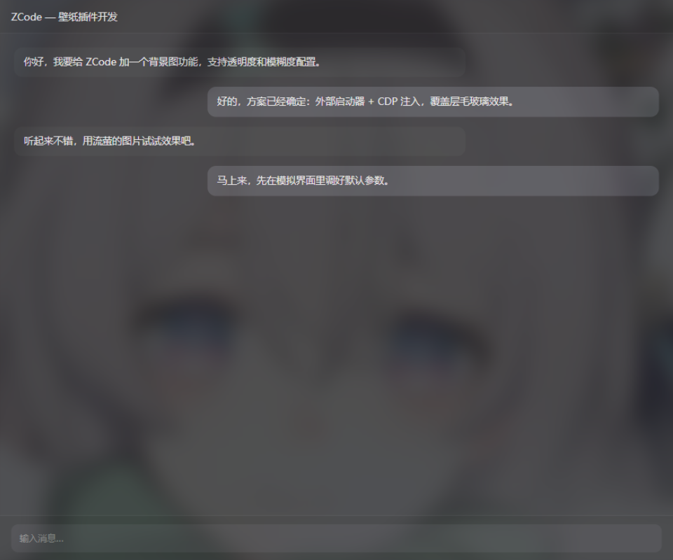

# ZCodeWallpaper — ZCode 壁纸版

给 ZCode 桌面客户端加一张毛玻璃壁纸背景图的小工具。

不修改 ZCode 的任何文件，ZCode 升级不受影响。双击托盘图标即可调参数，改动即时生效。



## 工作原理

ZCode 是 Electron 应用。本工具启动 ZCode 时附加 `--remote-debugging-port` 参数，然后通过 Chrome DevTools Protocol (CDP) 向渲染层注入一个 `pointer-events: none` 的毛玻璃壁纸层（毛玻璃水印效果，文字始终清晰），并保持连接以支持：

- 配置热更新（改参数立即生效）
- 新窗口自动跟随注入
- ZCode 退出后自动退出

注入器本体是约 1000 行的 C# 单文件程序，用 **Windows 自带的 .NET Framework 4.8 编译器**编译，产物约 100 KB，目标机器**无需安装任何运行库**。

## 使用

1. 从 [Releases](../../releases) 下载 `ZCodeWallpaper-vX.X.X.zip`，解压到任意目录
2. 先完全退出 ZCode（包括托盘图标）
3. 双击 `ZCodeWallpaper.exe`——首次运行会自动在桌面创建「ZCode 壁纸版」快捷方式，并弹出设置窗口
4. 点「浏览...」选一张图片，壁纸立即生效

之后都从桌面的「ZCode 壁纸版」图标启动 ZCode。

## 设置项

| 设置 | 说明 |
|---|---|
| 图片 | Windows 文件选择器挑选壁纸，清空则关闭壁纸 |
| 透明度 | 0~100%，越小越淡（建议 20~35） |
| 模糊度 | 0~40px，0 = 不模糊（建议 8~16） |
| 亮度 | 50%~150% |
| 缩放 | 100%~150%，略大于 100% 可避免模糊后边缘露白 |
| 填充 | cover = 铺满窗口（可能裁剪）/ contain = 完整显示 |
| 位置 | 上 / 中 / 下，控制画面焦点 |

所有改动即时生效并自动保存到 exe 同目录的 `config.txt`。

托盘右键菜单：设置 / 编辑配置文件 / 重新加载配置 / 退出。

## 从源码构建

```cmd
build.cmd
```

需要 Windows 10/11（自带 C# 5 编译器），无需安装任何 SDK。产物输出到 `dist\ZCodeWallpaper.exe`。

> 若 `dist\zcode.ico` 存在则作为 exe 图标（本仓库不分发该图标，从 ZCode 安装目录自行复制）。

## tools/ 目录

- `wallpaper-apply.js` —— 注入到页面的壁纸层 JS（C# 内嵌的同源参考副本）
- `inspect.mjs` —— 连接运行中的 ZCode，检查壁纸层的实际计算样式（调试用）
- `mock-cdp.mjs` —— 模拟 CDP 服务器，无 ZCode 环境下测试注入器（测试用）

需要 Node.js 18+。

## 已知限制

- ZCode 必须通过本工具（或其快捷方式）启动才会带壁纸；直接用官方图标启动时壁纸不生效
- 本工具以调试模式启动 ZCode，调试端口仅监听本机 (127.0.0.1)，但理论上本机其他进程可以访问它——介意请勿使用
- ZCode 大版本更新后若失效，重新运行本工具即可
- 适配版本：ZCode 3.14.4 (Electron 41 / Chromium 146)，其他版本未测试

## 免责声明

本项目为个人开发的第三方辅助工具，与 ZCode 官方无关。
壁纸图片版权归图片作者所有，请使用你有权使用的图片。

## License

[MIT](LICENSE)
